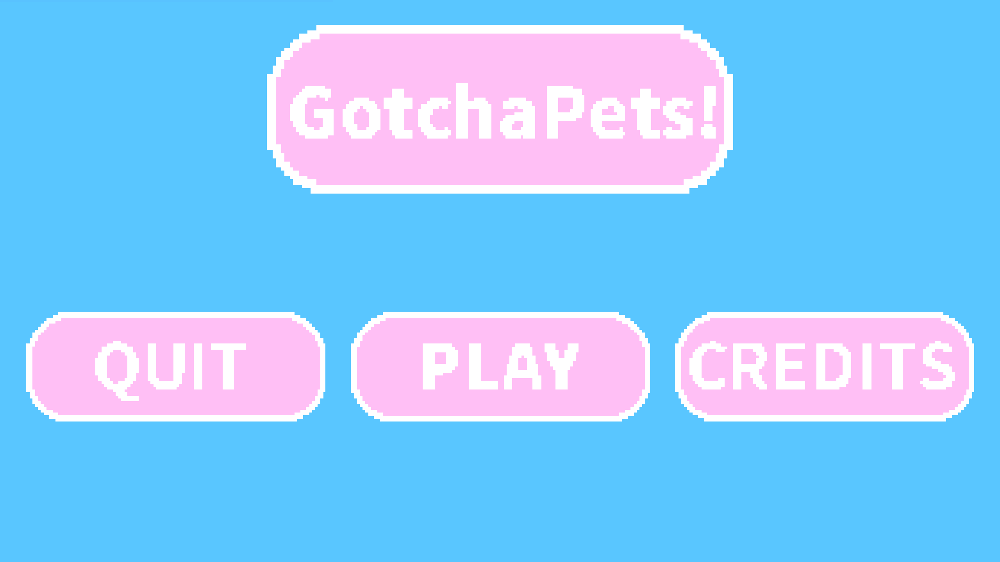
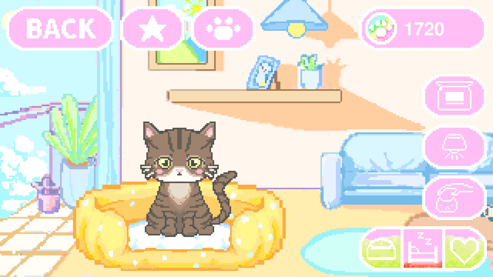
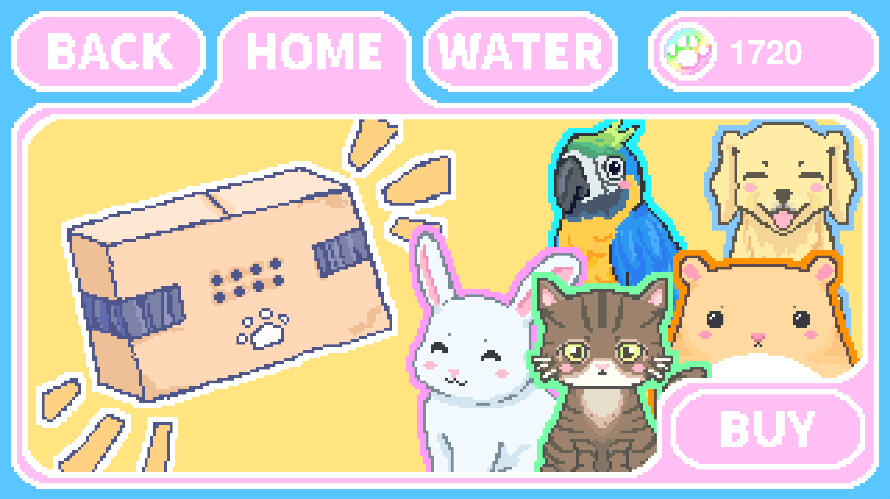
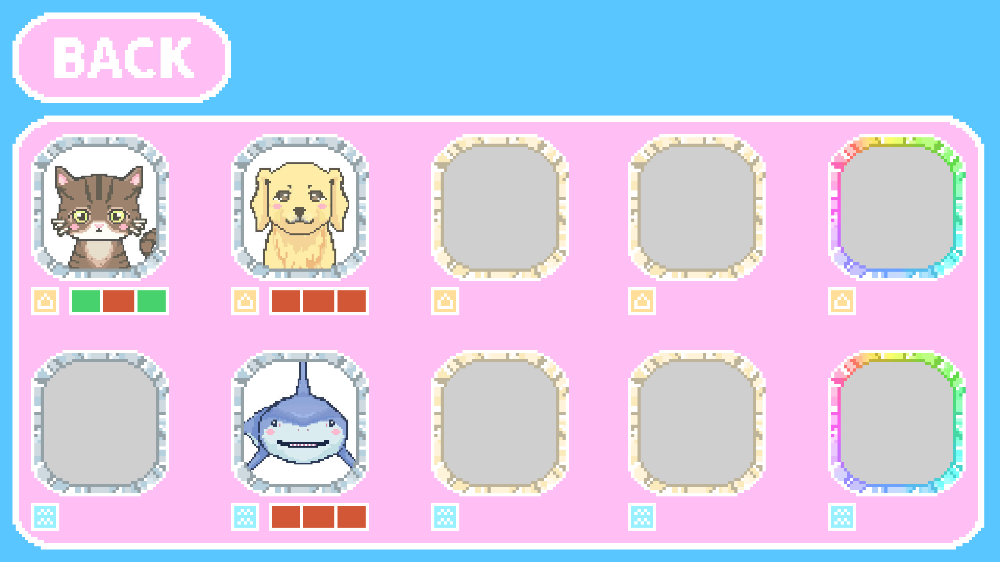

# 🐾 GotchaPets!

> *"Nurture virtual pets, earn coins, and collect them all in real-time!"*

## ℹ️ About the Game

GothaPets! is a graphical virtual pet simulator built in Java. You start with a basic companion and must care for their daily needs by feeding them, showing them love, and ensuring they get proper rest. By taking good care of your pets, you earn coins which can be spent in the in-game Gacha system to unlock rare and unique animals from different environments. The game features a real-time persistent save system, meaning your pets will continue to rest or grow hungry even when the application is closed!

## 🌟 Highlights

- **Real-Time Stat Tracking**: Your pet's Hunger, Energy, and Love stats calculate real-world time, seamlessly tracking offline progress while you are away.
- **Interactive Care System**: Feed, pet, and put your companion to sleep using custom UI elements to keep them happy and farm currency.
- **Gacha Mechanics**: Spend your hard-earned coins on multi-themed Gacha banners to expand your pet inventory with new species.
- **Persistent Save Architecture**: The game automatically serializes and saves your entire player profile, inventory, and coin balance.

## 🚀 Usage Instructions

The game relies entirely on a graphical user interface (GUI). Use your mouse (Left-Click) to interact with the on-screen buttons.

---


*(Caption: The main menu window.)*

| UI Button / Action | Functionality |
|:-------------------|:-----------------------------------------------------------------|
| **Quit Button** | Exits the game. |
| **Play Button** | Starts the game. |
| **Credits Button** | Shows the credits |

---


*(Caption: The main pet care window where you manage your companion's stats.)*

| UI Button / Action | Functionality |
|:-------------------|:-----------------------------------------------------------------|
| **Feed Button** | Replenishes hunger and grants a small coin reward (Only works when the pet is awake). |
| **Love Button** | Replenishes affection/love and grants a small coin reward (Only works when the pet is awake). |
| **Sleep Button** | Toggles the pet's sleep state. Letting a pet complete a full nap to 100%. Energy grants a 100-coin bonus. |
| **Gacha Button** | Opens the Gacha window to spend your coins and get new pets. |
| **Back Button** | Returns to the main menu. |

---


*(Caption: The Gacha window where players can spend coins to roll for new pets.)*

| UI Button / Action | Functionality |
|:-------------------|:-----------------------------------------------------------------|
| **Banner Tabs** | Switch between banners in the Gacha screen to target specific animal types. |
| **1 Hatch (160 Coins)** | Spends coins to trigger an egg-cracking animation and add a brand new random pet to your inventory. |
| **Back Button** | Returns to the game. |

---


*(Caption: The Pet list window where players can see their owned and not owned pets.)*

| UI Button / Action | Functionality |
|:-------------------|:-----------------------------------------------------------------|
| **Back Button** | Returns to the game. |

---

## ⬇️ Installation

To run this game locally, you will need **Java number** installed on your machine.

1. Download the latest game `.jar` file from this repository.
2. Open your terminal or command prompt.
3. Navigate to the folder where you downloaded the file:
   ```bash
   cd path/to/your/folder

4. Run the compiled application using Java:
   ```bash
   java -jar gotchaPets.jar
   ```

Important Notes:

* The game utilizes Java Swing and AWT for rendering the graphics and UI.
* Save files are generated automatically in the root folder as savegame.dat. Do not delete this file if you wish to keep your pets and coins!
 
No external libraries or frameworks are required to run the game.
